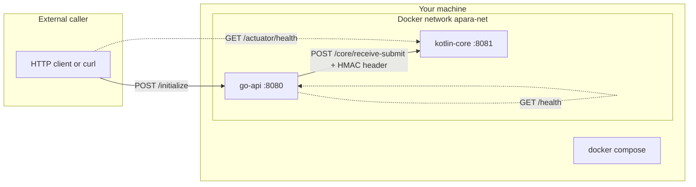

# Apara local stack — architecture and operations guide

This document is written for engineers who are new to the repository. It explains **why the system is shaped the way it is**, **how directories and files relate to each other**, **what you need installed**, and **exactly how to run and validate** the stack end to end.

---

## Part 1 — Business and technical context (read this first)

### What problem this repository simulates

Apara’s product narrative (from the employer brief) is **liquidity and settlement orchestration** between licensed banks: the platform **does not custody customer funds**. It **routes instructions** between institutions, with a production stack that would include components such as an edge tier, a core orchestration tier, and a settlement trust layer (Corda in their real architecture).

This take-home **does not run Corda**. Instead it provides:

- A **Go** service that models the **edge**: the only HTTP entry point for the “external” `POST /initialize` call.
- A **Kotlin / Spring Boot** service that models the **core**: settlement rules, liquidity pools, duplicate detection, and simulated failure modes.

The corridor is fixed in the brief (**Akin → Pawpaw**), and external networks are **simulated** with environment variables (for example, random AkinNet failure before the core is contacted).

### Architectural pattern in one sentence

**Clients talk only to Go. Go talks to Kotlin. Kotlin owns the simulated business state.** Configuration flows from `.env` → Docker Compose → each container’s environment.

---

## Part 2 — High-level architecture

### Logical view



- **go-api** is the **ingress** for the scripted client contract (`/initialize`).
- **kotlin-core** is **not** intended as a public internet-facing API in this exercise; it is what the edge calls internally. You still expose `8081` on the host for **health checks**, **debugging**, and **direct curl tests** of core behaviour (for example, ghost payments).

### Request lifecycle (happy path)

1. Caller sends **`POST http://localhost:8080/initialize`** with JSON body containing `templateId`, `amount`, `currency`, `receiverAccount`, `senderBank`.
2. **go-api** generates a **fingerprint** (unique id for this instruction attempt).
3. **go-api** runs the **AkinNet simulator**: if it “fails,” the caller receives **HTTP 422** and **`AKINNET_FAILURE`** — Kotlin is never contacted.
4. If AkinNet succeeds, **go-api** serializes a **`/core/receive-submit`** body (`fingerprint`, `templateId`, `amount`, `currency`, `senderBank`), computes **HMAC-SHA256** using `SPONSOR_HMAC_SECRET`, and POSTs to **`KOTLIN_CORE_URL`** (inside Docker this is `http://kotlin-core:8081`).
5. **kotlin-core** verifies the HMAC against the **raw bytes** of that JSON, then runs **SettlementService** rules (pools, duplicates, optional Cordapp failure, optional delayed scenario).
6. If Kotlin returns **HTTP 200**, **go-api** responds to the client with **`state: "IN_TRANSIT"`** and the fingerprint, per the fixed client contract.

### Why Docker Compose sits at the root

Compose is the **integration contract** for this role: one command brings up **both** services on a **shared network** with **DNS names** (`go-api`, `kotlin-core`), **health-ordered startup** (Go waits until Kotlin is healthy), and **injected configuration** from `.env`.

---

## Part 3 — Repository layout and how pieces connect

Below is the **mental model**: each path has a purpose, and dependencies flow downward.

```
Apara/                              ← project root; run Compose from here
├── docker-compose.yml              ← orchestrates services, network, health, ports
├── .env.example                    ← documented defaults (copy to .env)
├── .env                            ← your local secrets/overrides (gitignored)
├── README.md                       ← quick reference, curl recipes
├── PROJECT_GUIDE.md                ← this document
├── .gitignore
├── .gitattributes                  ← line endings for gradlew (Linux CI)
│
├── .github/workflows/ci.yml        ← PR pipeline: Go, Kotlin, then Docker smoke
│
├── go-api/                         ← Go edge service
│   ├── go.mod                      ← Go module definition (Go 1.21)
│   ├── main.go                     ← HTTP server: /health, /initialize, Kotlin client
│   ├── main_test.go                ← unit tests for handlers
│   ├── Dockerfile                  ← multi-stage build: compile → Alpine runtime
│   ├── .dockerignore               ← limits build context
│   └── .golangci.yml               ← linter config used in CI
│
└── kotlin-core/                    ← Spring Boot core service
    ├── settings.gradle.kts         ← Gradle project name
    ├── build.gradle.kts            ← Spring Boot, Kotlin JVM, dependencies
    ├── gradle.properties
    ├── gradlew / gradlew.bat       ← Gradle wrapper (reproducible builds)
    ├── gradle/wrapper/             ← wrapper jar + properties (Gradle 8.7)
    ├── Dockerfile                  ← JDK stage builds bootJar; JRE stage runs jar
    ├── .dockerignore
    └── src/
        ├── main/
        │   ├── kotlin/com/apara/core/
        │   │   ├── KotlinCoreApplication.kt   ← Spring Boot entrypoint
        │   │   ├── CoreController.kt            ← POST /core/receive-submit
        │   │   ├── CachedBodyFilter.kt          ← buffers body for HMAC verify
        │   │   ├── SettlementService.kt         ← pools, ghost, failures
        │   │   └── SettlementModels.kt          ← request/response data classes
        │   └── resources/application.yml        ← port 8081, actuator exposure
        └── test/kotlin/.../SettlementServiceTest.kt
```

### How data flows through Kotlin files

| File | Role |
|------|------|
| `KotlinCoreApplication.kt` | Bootstraps Spring; component scan lives under `com.apara.core`. |
| `CachedBodyFilter.kt` | For `POST /core/receive-submit` only, reads the body once, stores bytes on the request, and replays them to Jackson so the **same bytes** used for JSON parsing are the **same bytes** used for HMAC verification. |
| `CoreController.kt` | HTTP mapping for `/core/receive-submit`; calls `SettlementService`; maps domain outcomes to HTTP status codes (for example, conflict vs bad gateway). |
| `SettlementService.kt` | **Domain logic**: sponsor signature check delegation, idempotency / ghost detection, pool arithmetic, simulated Cordapp and sponsor-delay behaviour. |
| `SettlementModels.kt` | DTOs aligned with the JSON contract. |
| `application.yml` | Server port **8081**; Actuator exposes **health** (required for Compose healthchecks and CI). |

### How Go files fit together

| File | Role |
|------|------|
| `main.go` | Single binary: registers routes, reads environment variables, implements AkinNet simulation, calls Kotlin over HTTP, applies HMAC to outbound body. |
| `main_test.go` | Tests health JSON shape, AkinNet 422 path, unreachable core, and happy path with a mock Kotlin server. |

There is **no shared code** between Go and Kotlin in this repo: the **only contract** is HTTP + JSON + the sponsor secret. That mirrors how two services owned by different teams would integrate in production.

---

## Part 4 — Configuration model

### Environment variables (from the employer brief)

All of these names are **fixed by the brief**. They appear in **`.env.example`** with comments.

| Variable | Role |
|----------|------|
| `SPONSOR_HMAC_SECRET` | Shared secret. Go signs the outbound JSON body; Kotlin verifies. |
| `KOTLIN_CORE_URL` | Base URL for Kotlin (in Compose, overridden to `http://kotlin-core:8081` for `go-api`). |
| `AKN_POOL_INITIAL` | Starting balance for the simulated AKN pool (minor units). |
| `PAW_POOL_INITIAL` | Starting balance for the simulated PAW pool. |
| `AKINNET_FAILURE_RATE` | Probability in `[0,1]` that Go fails before calling Kotlin (HTTP 422). |
| `SPONSOR_DELAY_SECONDS` | Used by Kotlin to decide when the **DELAYED** demo path applies (see README / code). |
| `CORDAPP_FAILURE_RATE` | Probability that Kotlin simulates a Corda/Cordapp failure (HTTP 502 from core). |

### Where values are loaded

1. You copy **`.env.example` → `.env`** at the repository root.
2. **`docker-compose.yml`** references `env_file: .env` for **both** services.
3. **`docker-compose.yml`** additionally sets `KOTLIN_CORE_URL` for **`go-api`** via `environment:` so that inside the bridge network the hostname **`kotlin-core`** resolves correctly. Your `.env` may still contain `KOTLIN_CORE_URL` for documentation consistency; Compose’s `environment` entry wins for that service when both are present (Docker merges with explicit env taking precedence for `go-api`).

If you run services **without** Compose, you must set `KOTLIN_CORE_URL=http://localhost:8081` manually for Go.

---

## Part 5 — What to install

You have two supported ways to work: **Docker-first (recommended for the take-home)** and **native toolchains (optional)**.

### Option A — Docker only (minimum for submission)

Install **Docker Desktop** (Windows or macOS) or **Docker Engine + Compose plugin** on Linux.

- **Why this is enough:** Both `Dockerfile`s compile the services inside containers. You do not need Go or JDK installed on the host for the standard `docker compose up` workflow.

Verify:

```bash
docker --version
docker compose version
```

### Option B — Native development (optional)

Use this when you want faster iteration without rebuilding images.

| Tool | Version | Purpose |
|------|---------|---------|
| Go | 1.21+ | `cd go-api && go run .` or `go test ./...` |
| JDK | 17 | Gradle and Spring Boot 3 |
| Kotlin | via Gradle (1.9.x in `build.gradle.kts`) | You do not install Kotlin separately if you use Gradle |

On Windows, install Go and JDK from official installers and ensure **both are on `PATH`**. Point `JAVA_HOME` to JDK 17 for Gradle.

---

## Part 6 — Step-by-step: run the full stack with Docker

These steps assume **Windows PowerShell** at the repository root. Adjust paths if your clone lives elsewhere.

### Step 1 — Confirm you are in the correct directory

You must see `docker-compose.yml` in the current folder:

```powershell
cd C:\Users\User\Desktop\Apara
dir docker-compose.yml
```

### Step 2 — Create the local environment file

The application reads **`.env`**. Compose does **not** commit secrets; copy the template:

```powershell
copy .env.example .env
```

Open `.env` in an editor if you want to tune failure rates later. Defaults are safe for a first run.

### Step 3 — Start Docker Desktop

Ensure the Docker engine is **running** (whale icon in the system tray on Windows). If the engine is stopped, `docker compose` will fail immediately.

### Step 4 — Build and start containers

```powershell
docker compose up --build
```

What happens:

1. Compose builds **`kotlin-core`** image from `kotlin-core/Dockerfile` (Gradle `bootJar` in the build stage, JRE in the runtime stage).
2. Compose builds **`go-api`** image from `go-api/Dockerfile` (static Go binary on Alpine).
3. Compose attaches both to **`apara-net`**.
4. **`kotlin-core`** starts first. Its **healthcheck** runs `curl` against **`/actuator/health`** until it returns success.
5. Only after Kotlin is healthy does **`go-api`** start (because of `depends_on: condition: service_healthy`).
6. **go-api** healthcheck runs `wget` against **`/health`**.

Leave this terminal open to watch logs, or add `-d` for detached mode:

```powershell
docker compose up --build -d
docker compose logs -f
```

### Step 5 — Verify health endpoints

In a **second** terminal:

```powershell
curl http://localhost:8080/health
curl http://localhost:8081/actuator/health
```

You should see HTTP 200 responses. Go returns JSON including `"status":"ok"` and `"service":"go-api"`. Kotlin returns Actuator JSON with `"status":"UP"` at the top level.

### Step 6 — Run a business transaction (happy path)

```powershell
curl -X POST http://localhost:8080/initialize `
  -H "Content-Type: application/json" `
  -d "{\"templateId\":\"demo-1\",\"amount\":100,\"currency\":\"AKN\",\"receiverAccount\":\"ACC-001\",\"senderBank\":\"BANK-AKIN\"}"
```

Expected:

- HTTP **200**
- Response body includes **`fingerprint`**, **`state":"IN_TRANSIT"`**, and **`timestamp`**

That confirms: AkinNet did not fail, Kotlin accepted and processed the instruction, and Go returned the **client contract** from the brief.

### Step 7 — Shut down cleanly

```powershell
docker compose down
```

Add `-v` if you want to remove named volumes (this project uses mostly default volumes; `down` removes containers and the default network).

---

## Part 7 — Step-by-step: run services without Docker (optional)

Use this when debugging locally.

### 7.1 Start Kotlin first

```powershell
cd kotlin-core
.\gradlew.bat bootRun
```

Wait until the log shows Tomcat listening on **8081**.

### 7.2 Start Go with a local Kotlin URL

In another terminal:

```powershell
cd C:\Users\User\Desktop\Apara\go-api
$env:KOTLIN_CORE_URL="http://localhost:8081"
$env:SPONSOR_HMAC_SECRET="dev-secret-change-in-prod"
go run .
```

### 7.3 Call the same endpoints as in Part 6

If `go` is not installed, install Go 1.21+ or skip this path and use Docker only.

---

## Part 8 — Continuous integration (how it relates to your machine)

The file **`.github/workflows/ci.yml`** runs on **pull requests to `main`**:

1. **Job `go`:** `go mod tidy`, `golangci-lint`, `go test ./...`, `go build`.
2. **Job `kotlin`:** JDK 17, `./gradlew build test`.
3. **Job `integration`:** runs after both succeed; copies `.env.example` to `.env`, runs `docker compose up -d --build`, waits for both health URLs, curls `/initialize`, then `docker compose down -v`.

If your local machine passes Docker Compose but CI fails, compare **line endings** on `gradlew`, **Dockerfile** paths, and that **ports 8080/8081** are not hard-coded incorrectly.

---

## Part 9 — Operational troubleshooting

| Symptom | Likely cause | What to do |
|--------|----------------|------------|
| `docker compose` cannot connect to daemon | Docker Desktop not running | Start Docker; retry. |
| `go-api` keeps restarting | Kotlin never becomes healthy | `docker compose logs kotlin-core` — wait for Spring; check JVM startup errors. |
| `initialize` returns **401** from core path | HMAC mismatch | Ensure **same** `SPONSOR_HMAC_SECRET` in `.env` for both services; for direct Kotlin calls, sign the **exact** JSON bytes. |
| `initialize` returns **502** | Kotlin simulated Cordapp failure | Set `CORDAPP_FAILURE_RATE=0` in `.env` or retry (if non-zero, it is probabilistic). |
| Port **8080** or **8081** in use | Another process on host | Stop that process or change the left side of `ports:` in `docker-compose.yml` (and use the new port in curl). |

---

