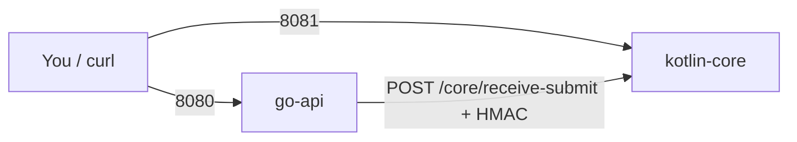
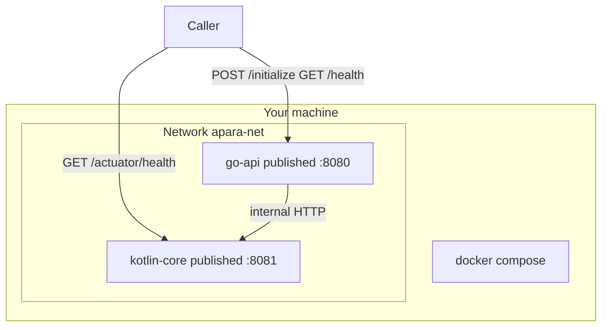
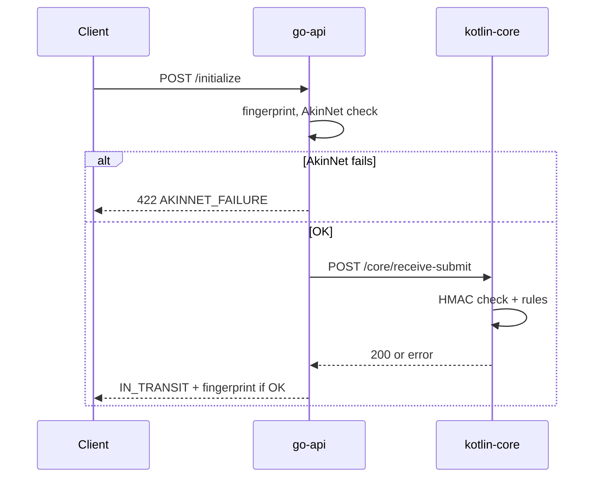
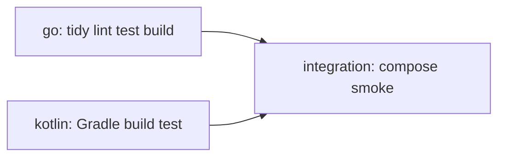

# Apara — quick start

Two services in Docker:

- **go-api** — you call this from outside (**port 8080**).
- **kotlin-core** — settlement logic behind it (**port 8081**).

**Docker** is enough to run everything. **Go 1.21+** and **JDK 17** (Kotlin **1.9+** via Gradle) are only needed if you run without containers.

---

## Run everything in ~5 minutes

**1.** Start **Docker Desktop** (or Docker on Linux). Wait until it is **running**.

**2.** Open the repo **root** (folder with `docker-compose.yml`):

```bash
git clone <your-repo-url>
cd Apara
```

**3.** Create config from the template:

```bash
cp .env.example .env
```

Windows PowerShell: `copy .env.example .env`

**4.** Build and start (first run can take several minutes):

```bash
docker compose up --build
```

Or in the background: `docker compose up --build -d`

**5.** In another terminal, same folder:

```bash
docker compose ps
```

Both services should show **`(healthy)`**.

**6.** Health checks:

*Mac / Linux / Git Bash:*

```bash
curl -fsS http://localhost:8080/health
curl -fsS http://localhost:8081/actuator/health
```

*Windows PowerShell — use **`curl.exe`**:*
```powershell
curl.exe http://localhost:8080/health
curl.exe http://localhost:8081/actuator/health
```

**7.** Optional — one successful payment through Go:

*Windows (reliable JSON body):*

```powershell
[System.IO.File]::WriteAllText("$PWD\init.json", '{"templateId":"demo-1","amount":100,"currency":"AKN","receiverAccount":"ACC-001","senderBank":"BANK-AKIN"}')
curl.exe -X POST http://localhost:8080/initialize -H "Content-Type: application/json" --data-binary "@$PWD\init.json"
```

*Mac / Linux:*

```bash
curl -sS -X POST http://localhost:8080/initialize \
  -H "Content-Type: application/json" \
  -d '{"templateId":"demo-1","amount":100,"currency":"AKN","receiverAccount":"ACC-001","senderBank":"BANK-AKIN"}'
```

You want **`IN_TRANSIT`** and a **`fingerprint`**.

**Stop:** `docker compose down`

---

## Architecture

**Simple view**



**Docker view**



**Happy path (what happens)**



Go and Kotlin do **not** share code — only **HTTP + JSON + `SPONSOR_HMAC_SECRET`**.

---

## What Compose does (order)

1. Builds **kotlin-core** (Gradle `bootJar`, then small JRE image).  
2. Builds **go-api** (static binary on Alpine).  
3. Puts both on **`apara-net`** (`kotlin-core` and `go-api` as hostnames).  
4. Starts Kotlin; waits until **`/actuator/health`** is OK.  
5. Starts Go only after Kotlin is healthy.  
6. Go’s own **`/health`** check runs in the container.

Detached logs: `docker compose logs -f`

---

## Prerequisites

| Need | When |
|------|------|
| **Docker Desktop** (or Engine) + Compose v2 | Always, for the default flow |
| **Go 1.21+** | Only to run `go-api` on the host |
| **JDK 17**, Kotlin **1.9+** (via Gradle) | Only to run `kotlin-core` on the host |

Check Docker:

```bash
docker --version
docker compose version
```

---

## Repo layout

```
.
├── docker-compose.yml
├── .env.example          → copy to .env
├── .gitattributes        → gradlew line endings for Linux CI
├── .github/workflows/ci.yml
├── go-api/
│   ├── Dockerfile
│   ├── main.go           /health, /initialize, calls Kotlin, HMAC
│   ├── main_test.go
│   ├── go.mod            Go 1.21
│   └── .golangci.yml
└── kotlin-core/
    ├── Dockerfile
    ├── gradlew, gradlew.bat, gradle/wrapper/
    └── src/main/kotlin/com/apara/core/
        ├── KotlinCoreApplication.kt
        ├── CoreController.kt      POST /core/receive-submit
        ├── CachedBodyFilter.kt    same bytes for JSON + HMAC
        ├── SettlementService.kt   pools, ghost, failures
        ├── SettlementModels.kt
        └── ../resources/application.yml   port 8081, actuator
```

**Go**

| File | Role |
|------|------|
| `main.go` | Routes, env, AkinNet sim, HTTP client to Kotlin, HMAC |
| `main_test.go` | Health, 422, core down, happy path with mock server |

**Kotlin**

| File | Role |
|------|------|
| `KotlinCoreApplication.kt` | Spring Boot start |
| `CachedBodyFilter.kt` | Buffer body so HMAC matches parsed JSON |
| `CoreController.kt` | Maps results to HTTP status codes |
| `SettlementService.kt` | Business rules + simulations |
| `application.yml` | **8081**, actuator **health** for Compose/CI |

---

## Environment variables

Names are **fixed by the brief**. Details and defaults: **`.env.example`**.

| Variable | Role |
|----------|------|
| `SPONSOR_HMAC_SECRET` | Go signs outbound JSON; Kotlin checks `X-Sponsor-Signature` (hex, raw body) |
| `KOTLIN_CORE_URL` | Kotlin base URL — **Compose sets** go-api to `http://kotlin-core:8081` (overrides `.env` for that service) |
| `AKN_POOL_INITIAL` / `PAW_POOL_INITIAL` | Starting pool balances (minor units) |
| `AKINNET_FAILURE_RATE` | `0..1` — Go may return **422** before calling Kotlin |
| `SPONSOR_DELAY_SECONDS` | Kotlin **DELAYED** demo when above `0` |
| `CORDAPP_FAILURE_RATE` | `0..1` — Kotlin may return **502** (simulated Cordapp failure) |

**Load path:** `.env` at repo root → both services via `env_file`. **`docker-compose.yml` `environment:`** on go-api wins for **`KOTLIN_CORE_URL`**.

---

## Endpoints (contract)

| Method | Path | Service | Notes |
|--------|------|---------|--------|
| GET | `/health` | go-api | `{"status":"ok","service":"go-api"}` |
| POST | `/initialize` | go-api | Success → `state: "IN_TRANSIT"`, `fingerprint`, `timestamp` |
| GET | `/actuator/health` | kotlin-core | `"status":"UP"` (+ other Actuator fields) |
| POST | `/core/receive-submit` | kotlin-core | Internal; HMAC on exact JSON bytes |

---

## Test scenarios (curl)

Change `.env` where noted, then `docker compose up -d --build`. Use **8080/8081** unless you remapped ports.

### Happy path

```bash
curl -sS -X POST http://localhost:8080/initialize \
  -H "Content-Type: application/json" \
  -d '{"templateId":"t1","amount":100,"currency":"AKN","receiverAccount":"recv-1","senderBank":"bank-akin"}'
```

→ **200**, `IN_TRANSIT`.

### AkinNet failure (422)

`.env`: `AKINNET_FAILURE_RATE=1`. Restart stack. Same POST as happy path → **422**, `AKINNET_FAILURE`. Set back to `0`.

### Ghost payment (409)

Same fingerprint twice to **Kotlin** (with HMAC from default secret):

```bash
BODY='{"fingerprint":"ghost-demo","templateId":"t1","amount":50,"currency":"AKN","senderBank":"bank-akin"}'
SIG=$(printf '%s' "$BODY" | openssl dgst -sha256 -hmac "dev-secret-change-in-prod" | sed 's/^.* //')

curl -sS -X POST http://localhost:8081/core/receive-submit \
  -H "Content-Type: application/json" \
  -H "X-Sponsor-Signature: $SIG" \
  -d "$BODY"

curl -sS -X POST http://localhost:8081/core/receive-submit \
  -H "Content-Type: application/json" \
  -H "X-Sponsor-Signature: $SIG" \
  -d "$BODY"
```

Second call → **GHOST_DETECTED**, **409**.

### Pool rejection (409)

Amount larger than **`AKN_POOL_INITIAL`** on a **fresh** stack:

```bash
curl -sS -X POST http://localhost:8080/initialize \
  -H "Content-Type: application/json" \
  -d "{\"templateId\":\"t2\",\"amount\":20000000,\"currency\":\"AKN\",\"receiverAccount\":\"recv-2\",\"senderBank\":\"bank-akin\"}"
```

→ **POOL_REJECTED** as **409** through go-api.

### DELAYED

`SPONSOR_DELAY_SECONDS` above `0` (default `60`). Amount divisible by **1_000_000**:

```bash
curl -sS -X POST http://localhost:8080/initialize \
  -H "Content-Type: application/json" \
  -d '{"templateId":"t-delay","amount":1000000,"currency":"AKN","receiverAccount":"recv-3","senderBank":"bank-akin"}'
```

You can raise **`SPONSOR_DELAY_SECONDS`** to experiment with timing (per brief).

### Cordapp failure (502)

`CORDAPP_FAILURE_RATE=1`, restart, call `/initialize` until **502** (random). Set `0` after.

---

## Run without Docker

**1 — Kotlin**

```bash
cd kotlin-core && ./gradlew bootRun
```

Windows: `gradlew.bat bootRun` — wait for **8081**.

**2 — Go** (other terminal)

```bash
cd go-api
export KOTLIN_CORE_URL=http://localhost:8081
export SPONSOR_HMAC_SECRET=dev-secret-change-in-prod
go run .
```

Windows PowerShell:

```powershell
cd go-api
$env:KOTLIN_CORE_URL="http://localhost:8081"
$env:SPONSOR_HMAC_SECRET="dev-secret-change-in-prod"
go run .
```

---

## CI (GitHub Actions)

Runs on **pull requests to `main`**.



| Job | What it runs |
|-----|----------------|
| go | `go mod tidy`, golangci-lint, `go test ./...`, `go build` |
| kotlin | JDK 17, `./gradlew build test` |
| integration | `cp .env.example .env`, `docker compose up -d --build`, wait **8080/health** + **8081/actuator/health**, `POST /initialize`, `docker compose down -v` |

Local OK but CI fails? Check **`gradlew` LF** (`.gitattributes`), Dockerfile paths, ports **8080/8081**.

---

## Troubleshooting

**Three common issues (brief):**

1. **Compose stuck / go-api not up** — Kotlin still starting or **8081** busy. `docker compose logs -f kotlin-core`; wait; bump `start_period` in compose if needed.  
2. **`/initialize` → 401** — Wrong or mismatched **`SPONSOR_HMAC_SECRET`**; manual Kotlin curls must HMAC the **exact** JSON bytes.  
3. **Connection refused** — Containers not running. `docker compose ps`; republish **8080/8081** if you changed `ports:`.

**More**

| Symptom | Likely cause | Fix |
|---------|----------------|-----|
| Cannot connect to Docker daemon | Engine off | Start Docker |
| go-api restart loop | Kotlin never healthy | Logs for kotlin-core; JVM errors |
| `/initialize` → 502 | Cordapp sim | `CORDAPP_FAILURE_RATE=0` or retry |
| Port in use | Other app | Stop it or change left side of `ports:` in compose |
| Kotlin CI fails on Linux | CRLF in `gradlew` | `.gitattributes` → `kotlin-core/gradlew` **LF** |
| Windows curl odd | Wrong tool | Use **`curl.exe`** |

---

## Evidence for submission (PDF)

Screenshot or terminal output: **`docker compose`** finished with **both services healthy** (e.g. `docker compose ps` with **`(healthy)`**). Add health curls and **`IN_TRANSIT`** if you want extra proof.

---

Take-home simulation only — not a hardened production setup.
